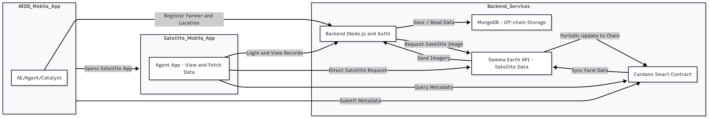
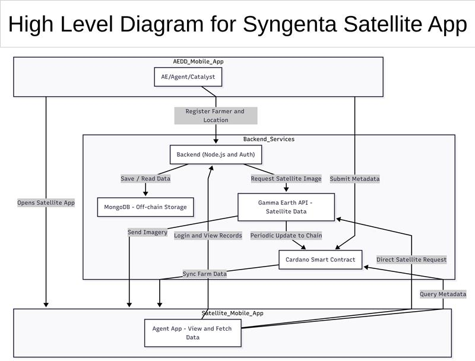
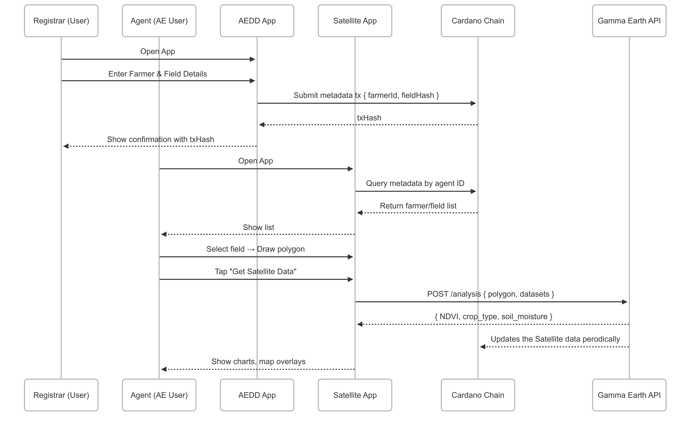

# Design Document and Project Plan for Cardano-Based Agricultural Oracle

## 1. Overview

This document outlines the design and project plan for a proof-of-concept (PoC) oracle system built on the Cardano blockchain to empower smallholder farmers in India. The system integrates earth observation, farm, and market data to facilitate trusted data exchange among farmers, Agri-Entrepreneurs (AEs), buyers, and government agencies. The focus is on the data structure, blockchain interaction, component architecture, technical specifications for the oracle contract, integration strategy, unit testing plan, and scalability measurement criteria.

---

## 2. Data Structure and Blockchain Interaction

### 2.1 Oracle Datum Structure

The oracle datum is a critical component stored on-chain to represent farm-related data. It is designed to be lightweight, extensible, and interoperable with Cardano's Plutus smart contracts.

**Datum Fields:**

1. **Farm Land Area** (`Integer`):
   - Represents the area of the farm in square yards.
   - Stored as a 64-bit integer to accommodate large farm sizes while maintaining efficiency.
   - Example: `5000` (for 5000 square yards).
2. **IPFS Hash for Farm Borders** (`ByteString`):
   - A 46-byte IPFS hash linking to a JSON file containing geospatial coordinates (latitude/longitude points) defining the farm's boundaries.
   - Stored as a Cardano `ByteString` for compatibility with Plutus.
   - Example: `QmXyZ123...` (IPFS CIDv0 hash).
3. **Arbitrary Data** (`BuiltinData`):
   - A flexible field for additional metadata (e.g., soil health metrics, crop type, or yield predictions).
   - Uses Cardano's `BuiltinData` type to support arbitrary Plutus-compatible data structures.
   - Example: `{ "cropType": "rice", "soilPH": 6.5 }`.

**Plutus Datum Schema:**

```haskell
data OracleDatum = OracleDatum
  { farmArea :: Integer
  , ipfsHash :: BuiltinByteString
  , arbitraryData :: BuiltinData
  }
```

The oracle datum is a critical component stored on-chain to represent farm-related data. It is designed to be lightweight, extensible, and interoperable with Cardano's Plutus smart contracts.

**Datum Fields:**

1. **Farm Land Area** (`Integer`):
   - Represents the area of the farm in square yards, with one square yard encoded as 1,000,000 units to ensure precision, and to facilitate standard smart contract interfaces for decimal precision operations.
   - Example: A farm of 500 square yards is represented as 500,000,000 (500 * 1,000,000).
2. **IPFS Hash for Farm Borders** (`ByteString`):
   - A 46-byte IPFS hash linking to a JSON file containing geospatial coordinates (latitude/longitude points) defining the farm's boundaries.
   - Stored as a Cardano `ByteString` for compatibility with Plutus.
   - Example: `QmXyZ123...` (IPFS CIDv0 hash).
3. **Arbitrary Data** (`BuiltinData`):
   - A flexible field for additional arbitrary metadata (e.g., soil health metrics, crop type, or yield predictions).
   - Uses Cardano's `BuiltinData` type to support arbitrary Plutus-compatible data structures.
   - Example: `{ "cropType": "rice", "soilPH": 6.5 }` would be encoded as the `BuiltinData` representation of the type:

```haskell
-- | Example arbitrary data that can be included in the oracle datum.
data CropInfo = 
   { cropType :: BuiltinByteString
   , soilPH :: Rational
   }
```

### 2.2 Blockchain Interaction

To ensure maximum usability, the system supports two oracle architectures on Cardano: **Reference UTxO Oracle Architecture** and **Signed Message Oracle Architecture**. Each has distinct trade-offs, balancing data availability, permissionless access, and operational efficiency.

**Reference UTxO Oracle Architecture**

In the reference UTxO oracle architecture, the oracle data is submitted to the chain directly as UTxOs that can be consumed as reference inputs by transactions that seek to interact with the oracle data. For our use-case, we model oracles as [CIP-68 NFTs](https://github.com/cardano-foundation/CIPs/blob/master/CIP-0068/README.md) where the CIP-68 user-token is the farm parcel NFT, and the corresponding CIP-68 reference-token is the UTxO with the oracle data provided for the associated farm parcel.  

There are a few key parameters for the system:
```haskell
-- | The public key hash of the party authorized to issue farm parcel DID NFTs.
issuanceOperator :: PubKeyHash 
issuanceOperator = ...

-- | A list of public key hashes of parties authorized to update the oracle data associated with the farm parcels. 
farmParcelOracleProviders :: [PubKeyHash]
farmParcelOracleProviders = [...]
```

**Oracle Management Spending Validator:** 

- **On-Chain**:
  - The `oracleManagementValidator` is a Plutus spending validator that manages oracle data updates and access control.
    - The lifecycle of all the CIP-68 reference-tokens are managed by this script, each oracle UTxO lives at the `oracleManagementScript` and contains a CIP-68 reference-token corresponding to the relevant farm parcel.
  - The validation logic of this script ensures that only relevant parties (`farmParcelOracleProviders`) are able to spend the Oracle UTxOs at this script, and enforces that they must produce a continuing output which preserves the reference-tokens and produces a valid oracle datum. 
- **Off-Chain**:
  - The oracle backend server fetches satellite data (via Gamma Earth APIs) and farmer inputs (via AE dashboards).
  - At regular intervals, the backend server submits transactions to update the oracle datum with newly fetched data.

**DID NFT Minting Policy** 

The DID NFT minting policy is a Plutus minting policy which manages the issuance of DIDs for individual farm parcels. 

- **On-Chain**:
  - The `farmParcelNFTMintingPolicy` validation logic enforces:
    - Exactly one user-token and reference-token pair is minted per farm parcel, ensuring DID uniqueness.
    - The reference-token is included in an output to the oracle management validator's script address. 
      - The initial oracle datum stored in this output is structurally valid.
    - Issuance of the DID is only possible with the authorization of the `issuanceOperator` (their signature must be present in any minting transaction).   
- **Off-Chain**:
  - Upon successful registration / onboarding of a new farm parcel, the backend will submit a transaction (signed by the `issuanceOperator` public key) that mints the user-token & reference-token pair corresponding to the farm parcel.
    - The transaction includes an output UTxO with the user-token sent to the farm parcel owner's wallet.
    - Another output UTxO with the reference-token and a valid oracle datum is sent to the oracle management validator's script address.
- **DID NFTs**:
  - Each CIP-68 user-token acts as a DID for an individual farm parcel, granting smallholders both ownership and control over their data.
  - The DIDs assign verifiable identities to farm parcels.

This architecture guarantees the data-availability of oracle data and ensures that the data can be consumed by dApps in a permissionless manner. 

**Signed Message Oracle Architecture**

The Signed Message Oracle Architecture is an alternative approach where data is not directly stored on-chain but is instead signed by a trusted oracle operator and passed into transactions that need to verify the data's authenticity. This pattern optimizes for low-cost, high-frequency data updates by minimizing on-chain footprint.

**Key Components:**

- **Off-Chain**:
  - The oracle operator backend periodically collects farm data, uses that data to construct the oracle datum message, and signs the message with their private key. 
  - Each signed message includes:
    - The oracle data (same schema as the on-chain `OracleDatum`) encoded as cborHex.
      - Concretely the oracle data in this message is the result of `serialiseData oracleDatum` where `oracleDatum` is some value of the type `OracleDatum`. 
    - Two timestamps to prevent replay attacks:
      - `validityStart` - the start of the validity range of this oracle data. 
      - `validityEnd` - the end of the validity range of this oracle data. 
      
Smart contract protocols can consume these messages as follows:
- A Plutus smart contract (e.g., for dApps consuming the oracle data) is provided with:
  - The oracle data and validity range timestamps. 
  - The signature of the oracle data message. 
- The validator verifies that:
  - The signature is valid over the provided data.
  - The signing key matches the expected oracle operator's public key.
  - The data timestamp or nonce is within an acceptable range (to prevent stale inputs).

**Advantages:**

- **Lower Oracle Operational Costs**: Since no state is stored or mutated on-chain, the oracle provider does not incur the costs of transaction fees required to publish the data to the chain periodically. 
- **High Frequency**: Oracle data can be can be updated frequently without the constraints of onchain throughput / bandwidth.
- **Dynamic Input**: Multiple dApps can consume the same oracle data simultaneously without regard for the potential of UTxO contention. In the reference input architecture, if an oracle datum is updated in the same block where a dApp is attempting to consume the datum, there is a potential that the dApp's transaction will fail as the oracle UTxO may already have been spent by the update transaction. 

**Trade-offs:**

- **No Native Data Availability**: Oracle data must be provided by the transaction creator; there is no guaranteed on-chain storage.
- **Higher Off-Chain Responsibility**: Applications must fetch and store the oracle data themselves.

This architecture complements the Reference UTxO Oracle architecture by serving use cases that demand real-time updates or when cost sensitivity outweighs on-chain persistence.

---

## 3. Unit Testing Plan

To ensure the correctness, reliability, and upgradability of the oracle system, a comprehensive unit testing strategy is defined across all smart contract components, datum structures, and integration workflows. The testing plan is divided into three primary layers: Datum validation, Script validation, and Integration tests.

### 3.1 Datum Integrity Tests

Unit tests will focus on serialization, schema integrity, and forward compatibility of the `OracleDatum` and any embedded custom data types (e.g., `CropInfo`).

**Test Cases:**

- **Signed Message Structural Integrity:**
  - Validate oracle datum message: `serialiseData oracleDatum <> integerToByteString validityStart <> integerToByteString validityEnd ≡ oracleDatumMessage` for valid `oracleDatum :: OracleDatum`.

- **Precision Integrity:**
  - Verify that farm areas represented with decimal-like scaling (e.g., `500 * 1_000_000`) maintain expected interpretation on-chain over common arithmetic operations.

- **Arbitrary Data Robustness:**
  - Fuzz test `arbitraryData` field with:
    - Valid known schema (e.g., correct `CropInfo`)
    - Unexpected but Plutus-compatible structures
    - Edge cases (empty maps, deeply nested structures, large byte strings)

- **Boundary Validation:**
  - Maximum field lengths for `ipfsHash`
  - Minimum and maximum land area edge cases (0, 1, 2^63-1)

### 3.2 Script Unit Tests

All Plutus validator and minting policy scripts will undergo isolated scenario-based testing.

**Oracle Management Validator:**

- **Positive Tests:**
  - Authorized oracle provider updates a datum with valid structure and preserves reference-token.
  - Continuity of UTxO validated (same asset class, correct script address).

- **Negative Tests:**
  - Unauthorized key attempts to spend an oracle UTxO.
  - Output datum is malformed or missing required fields.
  - Reference-token is removed, burned, or incorrectly transferred.

**DID NFT Minting Policy:**

- **Positive Tests:**
  - Correct issuance by `issuanceOperator` with matching user and reference-token minted.
  - Oracle UTxO correctly initialized with reference-token and valid datum.

- **Negative Tests:**
  - Attempt to mint without operator signature.
  - Minting multiple user-tokens or reference-tokens.
  - Oracle output not created, contains structurally invalid oracle datum, or does not contain the minted reference-token.

**Signed Message Validation (for consuming contracts):**

- **Positive Tests:**
  - Valid signature over CBOR-encoded oracle data with correct public key and valid timestamp window.

- **Negative Tests:**
  - Invalid signature.
  - Timestamps outside acceptable validity window.
  - Message tampering (mismatched data and signature).

---

## 4. A Preliminary Design of the User Interface and API

### 4.1 Section Overview
This document section outlines the technical architecture and implementation strategy for a blockchain-integrated agricultural data management system. The solution leverages Cardano blockchain for immutable data storage, Gamma Earth satellite APIs for crop insights, and provides a comprehensive mobile-first experience for agricultural entrepreneurs.

---

### 4.2 System Overview
#### 4.2.1 Core Objectives
The system is designed to provide real-time farm metrics stored on-chain using the Cardano blockchain, enabling transparent and immutable agricultural data management for farmers, admins, and agricultural entrepreneurs (AEs).
#### 4.2.1 Key Components
| Component         | Technology                  | Purpose                                                  |
|------------------|-----------------------------|----------------------------------------------------------|
| Mobile Frontend   | React Native + Expo         | User interface for data entry and visualization         |
| Backend API       | Node.js + Express           | Business logic and blockchain integration               |
| Database          | MongoDB                     | Application data storage with geospatial indexing       |
| Blockchain        | Cardano + Blockfrost API    | Immutable data verification and audit trail             |
| Satellite Data    | Gamma Earth API             | Real-time crop health and NDVI analytics                |

#### 4.2.3 User Ecosystem
- **Agents/AEs/Catalysts**: Register farmers and manage field data  
- **Farmers**: Benefit from crop insights and blockchain-verified records  
- **System Administrators**: Monitor and maintain the platform  

---

### 4.3 System Architecture
#### 4.3.1 Data Flow Architecture
- **Authentication Flow**
    - User enters credentials in mobile app
    - Backend validates against MongoDB user collection
    - JWT token issued and stored securely (Keychain/Keystore)
    - Token used for all subsequent API requests

- **Farmer Registration Flow**
    - Agent submits farmer data through mobile app
    - Backend saves farmer record to MongoDB
    - Cardano transaction created with metadata:
      ```json
      {
        "farmerId": "123",
        "farmerName": "John Doe",
        "timestamp": "2025-05-28T10:00:00Z"
      }
      ```
    - Transaction hash stored for audit trail

- **Field Registration Flow**
  - Agent submits field polygon (GeoJSON format)
  - MongoDB stores with 2dsphere geospatial indexing
  - Optional blockchain transaction for field verification
  - Integration with Gamma Earth API for satellite data

- **Crop Insights Flow**
  - System queries Gamma Earth API with field coordinates
  - Receives NDVI data, crop health metrics, and satellite imagery
  - Data processed and cached in MongoDB
  - Results displayed in mobile app with visual analytics


- **View Registered Farmer Data Flow**
  - Agent/AE/Catalyst requests a list of registered farmers or fields.
  - The backend:
    - Retrieves this data directly from MongoDB.
    - Returns it to the app for display.
  - No interaction with the blockchain is required for this operation.

- **Data Flow Diagram**



#### 4.3.2 High Level Diagram


#### 4.3.3 Low Level Diagram


---
### 4.4 Technical Specification
This section outlines the technical requirements and integration design for the project leveraging the Cardano blockchain.
- **UI Mockups**
  - Provided by a dedicated design team.
  - Will be implemented using **React Native** and **EXPO Framework**.
  - Follows mobile-first best practices for Agent/AE/Catalyst workflows.
> UI mockups figma link (added later)
- **Backend Stack**
  - Built with **Node.js** and **Express**.
  - Interacts with the Cardano blockchain using:
    - **Lucid SDK**
    - **Mesh SDK** (if needed)
  - Responsible for:
    - Authentication
    - Data processing and validation
    - Blockchain transaction management
    - Communication with MongoDB and external APIs
- **Blockchain Access**
  - Utilizes **Blockfrost API** to:
    - Fetch on-chain data
    - Specifically target OracleDatum from a specified **smart contract address**
  - Used for verification and visualization of blockchain-anchored metadata.
- **Data Visualization**
  - The mobile app decodes and renders specific OracleDatum fields:
    - `farmArea`
    - `ipfsHash`
    - `arbitraryData`
  - These fields are presented to users in readable formats using charts, cards, or text views in the React Native frontend.
- **Development Environment**
  - **VSCode**: Primary code editor for both backend and frontend development.
  - **Android Emulator**: Used to run and test the React Native app during development.
- **Deployment Flexibility**
  - Environment-specific configurations are supported:
    - `development`
    - `QA`
    - `production`
  - Allows seamless switching of:
    - API endpoints
    - Blockchain network settings
    - Feature toggles or debug flags

---
### 4.5 Integration Strategy with PoC Oracle (Preliminary)
#### 4.5.1 Oracle Data Structure
The Cardano smart contract utilizes the following OracleDatum structure:
```haskell
data OracleDatum = OracleDatum
  { farmArea :: Integer
  , ipfsHash :: BuiltinByteString
  , arbitraryData :: BuiltinData
  }
  ```
Typescript Representation:
```typescript
interface OracleDatum {
  farmArea: number;
  ipfsHash: string;        // Hex or base58 encoded
  arbitraryData: any;      // Parsed JSON or raw bytes
}
```
#### 4.5.2 Blockchain Integration Implementation
Blockfrost Configuration
```javascript
import { Lucid, Blockfrost } from "lucid-cardano";

const lucid = await Lucid.new(
  new Blockfrost(
    "https://cardano-mainnet.blockfrost.io/api/v0", 
    process.env.BLOCKFROST_API_KEY
  ),
  "Mainnet" // or "Preprod" for testing
);
```
#### 4.5.3 API Endpoints for Oracle Integration

| Endpoint                      | Method | Description                         | Response                          |
|------------------------------|--------|-------------------------------------|-----------------------------------|
| `/api/oracle/:address`       | GET    | Fetch latest OracleDatum            | JSON with decoded data            |
| `/api/oracle/history/:address` | GET  | Historical oracle data              | Array of timestamped entries      |
| `/api/oracle/verify/:txHash` | GET    | Verify specific transaction         | Verification status               |

#### 4.5.4 Gamma Earth Satellite Integration
##### 4.5.4.1 S2DR3 RISC API – Version 0.2
>**Important:** The API is asynchronous.
A POST request launches the processing job and immediately returns metadata.
The actual processed imagery appears in the corresponding GCP bucket a few minutes later.

**A. Job Submission Endpoint**
```curl
POST https://s2dr3-job-20250428-862134799361.europe-west1.run.app/{USER_ID}
```
- **Request Example:**
```json
{
  "date": "2023-05-01",
  "aoi": "19.93 49.28 20.00 49.35"  // minx, miny, maxx, maxy
}
```
> The AOI should not exceed 150 sq.km (roughly a 12km x 12km box).

- **Response Example**
```json
{
  "ISO": "UA",
  "MGRS": "35UQR",
  "PID": "T35UQR-20230810-u8600146",
  "aoi_overlap": "1.0",
  "bbox": "30.85 50.39 30.88 50.42",
  "date": "20230810",
  "job_id": "e26bb408-d330-11ef",
  "save_path_MS": "gs://sentinel-s2dr3/UA/T35UQR/T35UQR-u8600146/S2L2Ax10_T35UQR-u8600146-20230810_MS.tif",
  "save_path_TCI": "gs://sentinel-s2dr3/UA/T35UQR/T35UQR-u8600146/S2L2Ax10_T35UQR-u8600146-20230810_TCI.tif"
}

```
- **Parameter Descriptions**

| Field           | Description                                                                                         |
|----------------|-----------------------------------------------------------------------------------------------------|
| `save_path_TCI` | Download URL for the super-resolved `true-colour` dataset |
| `save_path_MS`  | Download URL for the super-resolved `multi-spectral`

**B. Check Job Status**
  - Endpoint:
  ```curl
  GET https://s2dr3-job-20250428-862134799361.europe-west1.run.app/{USER_ID}/{job_id}
  ```
  - Response Example:
  ```json
  {
    "PID": "T35UQR-u8600146-20230810",
    "State": "completed",
    "jobID": "e26bb408-d330-11ef"
  }
  ```
**C. Tile Server**
```curl
https://kgbbmarmdgv53gdb47pls2v2oe0qotcs.lambda-url.eu-central-1.on.aws/cog/
tiles/WebMercatorQuad/{z}/{x}/{y}@2x?url=s3://sentinel-s2dr3/{MGRS}/{SID}/{P
ID}/S2L2A_{PID}_TCI.tif
```
```curl
https://kgbbmarmdgv53gdb47pls2v2oe0qotcs.lambda-url.eu-central-1.on.aws/cog/
tiles/WebMercatorQuad/{z}/{x}/{y}@2x?url=s3://sentinel-s2dr3/{MGRS}/{SID}/{P
ID}/S2L2A_{PID}_NDVI.tif
```
```curl
https://kgbbmarmdgv53gdb47pls2v2oe0qotcs.lambda-url.eu-central-1.on.aws/cog/
tiles/WebMercatorQuad/{z}/{x}/{y}@2x?url=s3://sentinel-s2dr3/{MGRS}/{SID}/{P
ID}/S2L2A_{PID}_IRP.tif
```
```
PID = "T35UQR-860014671-20230810"
MGRS = "T35UQR"
SID = "860014671"
```
##### 4.5.4.2 Application Implementation
To interact with the `S2DR3 RISC API` in React Native and render `.tif`(GeoTIFF) satellite imagery using something like geotiff.js, we need to:

**A. Submit a Job (React Native API Call)**
```typescript

// SubmitSatelliteJob.ts
export async function submitSatelliteJob(userId: string, date: string, aoi: string) {
  const url = `https://s2dr3-job-20250428-862134799361.europe-west1.run.app/${userId}`;

  const payload = {
    date,
    aoi, // format: "minx miny maxx maxy"
  };

  try {
    const res = await fetch(url, {
      method: 'POST',
      headers: { 'Content-Type': 'application/json' },
      body: JSON.stringify(payload),
    });

    const data = await res.json();
    if (!res.ok) throw new Error(data.message || 'Job submission failed');

    return data; // contains PID, job_id, and save paths
  } catch (err) {
    console.error(err);
    throw err;
  }
}
```
**B. Poll Job Status**
```typescript
export async function getJobStatus(userId: string, jobId: string) {
  const url = `https://s2dr3-job-20250428-862134799361.europe-west1.run.app/${userId}/${jobId}`;

  try {
    const res = await fetch(url);
    const data = await res.json();

    if (!res.ok) throw new Error(data.message || 'Status check failed');

    return data; // should include "State": "completed"
  } catch (err) {
    console.error(err);
    throw err;
  }
}

```
**C. View GeoTIFF in React Native**
> Added later
  
---

### 4.6 Application Unit Testing Plan 
#### 4.6.1 Backend Testing Framework
##### Testing Stack
- **Framework:** Jest
- **Mocking:** Jest mocks
- **API Testing:** Supertest
##### Test Categories
- **API Endpoint Testing**
```javascript
describe('Oracle Data API', () => {
  beforeEach(async () => {
    await setupTestDatabase();
  });

  test('GET /api/oracle/:address - valid address', async () => {
    const mockUtxo = createMockUtxo();
    jest.spyOn(lucid.fetcher, 'fetchUTxOs').mockResolvedValue([mockUtxo]);
    
    const response = await request(app)
      .get('/api/oracle/addr_test123...')
      .expect(200);
    
    expect(response.body).toHaveProperty('farmArea');
    expect(response.body).toHaveProperty('ipfsHash');
  });

  test('GET /api/oracle/:address - invalid address', async () => {
    const response = await request(app)
      .get('/api/oracle/invalid-address')
      .expect(400);
    
    expect(response.body.error).toBe('Invalid Cardano address');
  });
});
```
- **Blockchain Integration Testing**
```javascript
describe('Cardano Integration', () => {
  test('should decode OracleDatum correctly', () => {
    const mockDatum = 'hex_encoded_datum';
    const decoded = parseOracleDatum(mockDatum);
    
    expect(decoded.farmArea).toBe(100);
    expect(decoded.ipfsHash).toBe('QmTest123...');
  });

  test('should handle invalid datum gracefully', () => {
    const invalidDatum = 'invalid_hex';
    expect(() => parseOracleDatum(invalidDatum)).toThrow('Invalid datum format');
  });
});
```

#### 4.6.2 Frontend Testing Framework
##### Testing Stack
  - **Framework:** Jest + React Testing Library
  - **Component Testing:** @testing-library/react-native
##### Test Examples
```javascript
describe('FarmCard Component', () => {
  test('renders oracle data correctly', () => {
    const mockData = {
      farmArea: 42,
      ipfsHash: 'QmTest123',
      ndvi: 0.67
    };
    
    const { getByText } = render(<FarmCard data={mockData} />);
    
    expect(getByText('42 hectares')).toBeTruthy();
    expect(getByText('NDVI: 0.67')).toBeTruthy();
  });

  test('handles loading state', () => {
    const { getByTestId } = render(<FarmCard loading={true} />);
    expect(getByTestId('loading-spinner')).toBeTruthy();
  });
});
```
---

### 4.7 Security Testing Approach

#### 4.7.1 Backend Security Measures

- **Authentication & Authorization**

```javascript
// JWT Implementation with security headers
const jwt = require('jsonwebtoken');
const rateLimit = require('express-rate-limit');

// Rate limiting
app.use('/api/', rateLimit({
  windowMs: 15 * 60 * 1000, // 15 minutes
  max: 100, // requests per window
  message: 'Too many requests from this IP'
}));

// Input validation
const { check, validationResult } = require('express-validator');

app.post('/api/farmers', [
  check('name').isLength({ min: 2, max: 50 }).escape(),
  check('email').isEmail().normalizeEmail(),
  check('phone').isMobilePhone(),
], (req, res) => {
  const errors = validationResult(req);
  if (!errors.isEmpty()) {
    return res.status(400).json({ errors: errors.array() });
  }
  // Process request
});
```
- **Blockchain Security**
```javascript
// Cardano address validation
const validateCardanoAddress = (address) => {
  const addressRegex = /^addr1[a-z0-9]{98}$/; // Mainnet
  const testnetRegex = /^addr_test1[a-z0-9]{98}$/; // Testnet
  
  return addressRegex.test(address) || testnetRegex.test(address);
};

```
#### 4.7.2 Security Testing Checklist

**API Security Tests**
- [ ] Input Validation: SQL injection, XSS, command injection
- [ ] Authentication: JWT token validation, session management
- [ ] Authorization: Role-based access control
- [ ] Rate Limiting: DDoS protection, brute force prevention
- [ ] HTTPS: SSL/TLS configuration, certificate validation
- [ ] CORS: Cross-origin request policies

**Database Security Tests**
- [ ] Access Control: User permissions and roles
- [ ] Encryption: Data at rest and in transit
- [ ] Backup Security: Encrypted backups, access logs
- [ ] Connection Security: SSL connections, firewall rules

**Blockchain Security Tests**
- [ ] Address Validation: Proper format checking
- [ ] Private Key Management: Secure key storage
- [ ] Smart Contract Interaction: Parameter validation

#### 4.7.3 Frontend Security Measures
**Secure Storage Implementation**
```javascript
import * as SecureStore from 'expo-secure-store';

// Store sensitive data
const storeToken = async (token) => {
  await SecureStore.setItemAsync('authToken', token, {
    keychainService: 'agritech-app',
    encrypt: true
  });
};

// Retrieve with validation
const getToken = async () => {
  try {
    const token = await SecureStore.getItemAsync('authToken');
    if (token && !isTokenExpired(token)) {
      return token;
    }
    return null;
  } catch (error) {
    console.error('Token retrieval failed:', error);
    return null;
  }
};

```
#### 4.7.4 Network Security
```javascript
// HTTPS enforcement
const API_BASE_URL = __DEV__ 
  ? 'https://dev-api.agritech.com' 
  : 'https://api.agritech.com';

// Certificate pinning (production)
const secureAxios = axios.create({
  baseURL: API_BASE_URL,
  timeout: 10000,
  headers: {
    'Content-Type': 'application/json'
  }
});

```
---

### 4.8 Scalability Measurement Criteria
#### 4.8.1 Performance & Memory Optimizations (React Native)
To ensure smooth performance and efficient memory usage in the React Native mobile application, the following best practices are implemented:

- **Efficient List Rendering**

    - Use **FlatList** or **SectionList** for scrollable data (e.g., farmers, fields).
    - These components recycle rows for constant memory usage.
    - Implement `getItemLayout` to avoid dynamic height calculations and improve scroll performance.


- **Hermes Engine**

    - Enable **Hermes**, the optimized JavaScript engine for React Native.
    - Hermes compiles JavaScript into bytecode ahead-of-time.
    - Benefits:
        - Faster app startup
        - Lower memory usage
        - Reduced runtime parsing overhead


-  **Lazy Loading**

    - Use `React.lazy()` and `Suspense` to **lazy-load heavy components**.
    - Defer loading of large modules (e.g., map screens, chart visualizations) until needed.
    - This keeps the **initial bundle small**, improving cold start time.


- **Render Optimization**

    - Use **React.memo**, **PureComponent**, **useMemo**, and **useCallback** to:
    - Avoid unnecessary re-renders
    - Cache expensive computations
    - Ensure shallow comparison of props
    - Prefer **immutable data structures** to simplify change detection.

- **Image Optimization**

    - Compress and resize images before bundling.
    - Prefer modern formats like **WebP** where supported.
    - Use libraries like **react-native-fast-image** for:
    - Disk and memory caching
    - Avoiding redundant downloads
    - Avoid animating large images on the JS thread.
    - Use `transform: scale` instead of changing `width/height`.

- **Memory Management**

    - Clean up side effects:
        - Cancel timers, API calls, or event subscriptions in `useEffect` cleanup or `componentWillUnmount`.
    - Avoid large, persistent in-memory caches.
    - Use **React Native's Performance Monitor** to:
        - Detect frame drops
        - Identify memory spikes

Together, these techniques ensure smooth UI (60 FPS) and low memory usage even as data grows. 

---

### 4.9 Deployment Plan

#### 4.9.1 Deployment Overview
This deployment plan outlines the steps and strategies to deliver and maintain the mobile application across development, staging, and production environments. The mobile frontend is built using **React Native with Expo**, while the backend uses **Node.js with Express**. Data is managed via **MongoDB** and **PostgreSQL**. A future enhancement will enable integration with a parent app via **Single Sign-On (SSO)**.

#### 4.9.2 Deployment Environments
- **Development Environment**
  - **Purpose**: Internal testing and rapid development.
  - **Deployment**: Local Expo CLI / Expo Go + Docker-based local backend.
  - **Access**: Developers only.
- **Production Environment**
  - **Purpose**: End-user availability.
  - **Deployment**:
    - **Frontend**: Expo EAS build for iOS/Android (App Store / Google Play)
    - **Backend**: Node.js hosted on a cloud provider (e.g., AWS)
    - **Database**: Managed services (MongoDB)

#### 4.9.3 Frontend Deployment (React Native + Expo)
- **Development Build**: Via Expo Go (QR code scanning)
- **Production Build**:
  - Use **Expo EAS Build** for custom builds
  - EAS Submit to deploy to:
    - **App Store Connect** (iOS)
    - **Google Play Console** (Android)

#### 4.9.4 Backend Deployment (Node.js/Express)
- **Containerization**: Dockerize the Node.js app
- **CI/CD Pipeline**: GitHub for automated builds and deployments
- **Hosting Options**:
  - AWS EC2

#### 4.9.5 Database Setup
- **MongoDB**:
  - **Development**: Local MongoDB or MongoDB Atlas free tier
  - **Production**: MongoDB Atlas with backups and scaling
- **PostgreSQL**:
  - **Development**: Local instance or Docker
  - **Production**: Managed PostgreSQL (e.g., AWS RDS)

#### 4.9.6 Single Sign-On (SSO) Integration
- **Planned Integration**:
  - Enable app access via parent app using a centralized **SSO system**
  - Likely protocols: OAuth2 / OpenID Connect
- **Approach**:
  - Use parent app’s authentication provider for secure token exchange
  - Share session/token via deep linking or secure API handshake
  - Token validation middleware on the backend
- **Dependency**:
  - Coordination with the parent app’s team
  - Updated user/session models to support external identity providers

#### 4.9.7 Rollback Strategy
- **Frontend**: Use EAS Update rollback to revert to last stable OTA
- **Backend**: Maintain last known working Docker image version
- **Database**: Point-in-time recovery via backups (MongoDB Atlas / PostgreSQL RDS)


