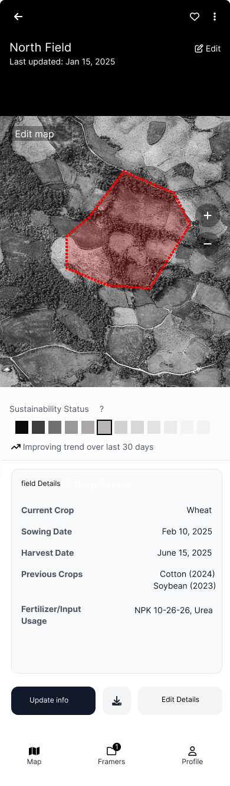
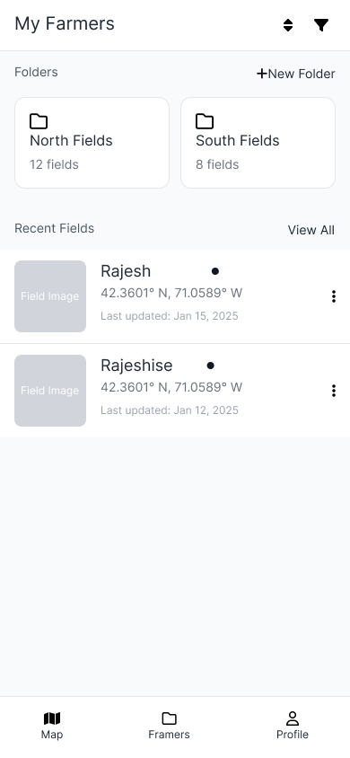
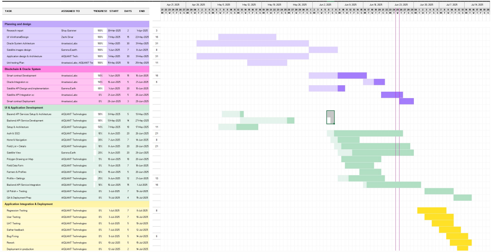

# Design Document and Project Plan for Cardano-Based Agricultural Oracle

## 1. Overview

<!-- This document outlines the design and project plan for a proof-of-concept (PoC) oracle system built on the Cardano blockchain to empower smallholder farmers in India. The system integrates earth observation, farm, and market data to facilitate trusted data exchange among farmers, Agri-Entrepreneurs (AEs), buyers, and government agencies. The focus is on the data structure, blockchain interaction, component architecture, technical specifications for the oracle contract, integration strategy, unit testing plan, and scalability measurement criteria.

The solution leverages Cardano blockchain for immutable data storage, Gamma Earth satellite APIs for crop insights, and provides a comprehensive mobile-first experience for agricultural entrepreneurs. -->
This document outlines the design and project plan for a proof-of-concept (PoC) oracle
system built on the Cardano blockchain to empower smallholder farmers in India. The
system integrates earth observation, farm, and market data to facilitate trusted data
exchange among farmers, Agri-Entrepreneurs (AEs), buyers, and government agencies.

The solution leverages the Cardano blockchain for immutable data storage, Gamma
Earth satellite APIs for crop insights, and provides a comprehensive mobile-first experience for agricultural entrepreneurs.

### 1.1 Data Flow Architecture
- **Authentication Flow**
    - User enters credentials in mobile app
    - Backend validates against MongoDB user collection
    - JWT token issued and stored securely (Keychain/Keystore)
    - Token used for all subsequent API requests

- **Farmer Registration Flow**
    - Agent submits farmer data through mobile app
    - Backend saves farmer record to MongoDB
    - Cardano transaction created with metadata:
      ```json
      {
        "farmerId": "123",
        "farmerName": "John Doe",
        "timestamp": "2025-05-28T10:00:00Z"
      }
      ```
    - Transaction hash stored for audit trail

- **Field Registration Flow**
  - Agent submits field polygon (GeoJSON format)
  - MongoDB stores with 2dsphere geospatial indexing
  - Optional blockchain transaction for field verification
  - Integration with Gamma Earth API for satellite data

- **Crop Insights Flow**
  - System queries Gamma Earth API with field coordinates
  - Receives NDVI data, crop health metrics, and satellite imagery
  - Data processed and cached in MongoDB
  - Results displayed in mobile app with visual analytics


- **View Registered Farmer Data Flow**
  - Agent/AE/Catalyst requests a list of registered farmers or fields.
  <!-- - The backend:
    - Retrieves this data directly from MongoDB.
    - Returns it to the app for display. -->
  - Backend retrieves this data directly from MongoDB and returns it to the app
  - No interaction with the blockchain is required for this operation.

#### Data Flow Diagram


#### High Level Diagram


#### Low Level Diagram


---

## 2. User Interface(UI) Design

#### 2.1 Core Objectives
The system is designed to provide real-time farm metrics stored on-chain using the Cardano blockchain, enabling transparent and immutable agricultural data management for farmers, admins, and agricultural entrepreneurs (AEs).

---

### 2.2 Technical Specification
This section outlines the technical requirements and integration design for the project leveraging the Cardano blockchain.
- **UI Mockups**: Provided by design team.
- **Implementation**:
  - React Native with EXPO Framework
  - Mobile-first design for Agent/AE/Catalyst workflows

### 2.3 Screen Reference

  #### AEDD application with Oracle Satellite app deep linking
   
   *Figure 1: AEDD application with Oracle Satellite app deep linking*

  #### App splash screen
   
   *Figure 2: App splash screen*

  #### FieldView search screen
   
   *Figure 3: FieldView search screen*

  #### Detailed search filters
   
   *Figure 4: Detailed search filters*

  #### Interactive map display
   
   *Figure 5: Interactive map display*

  #### Boundary drawing tool
   
   *Figure 6: Boundary drawing tool*

  #### Precision editing interface
   
   *Figure 7: Precision editing interface*

  #### Shape modification screen
   
   *Figure 8: Shape modification screen*

  #### Data export options
   
   *Figure 9: Data export options*

  #### Extended metadata entry
   
    *Figure 10: Extended metadata entry*

  #### Field details screen
   
    *Figure 11: Field details screen*

### 2.4 User Management
  #### Agricultural property dashboard
   
    *Figure 12: Agricultural property dashboard*

  #### Registered farmer list
   
    *Figure 13: Registered farmer list*

  #### Individual farmer details
   
    *Figure 14: Individual farmer details*

  #### Cardano wallet authentication (Additional Implementation-Optional)
   
    *Figure 15: Cardano wallet authentication (Additional Implementation-Optional)*

  #### Digital asset interface (Additional Implementation-Optional)
   
    *Figure 16: Digital asset interface (Additional Implementation-Optional)*

  #### Agri Entrepreneur profile screen
   
    *Figure 17: Agri Entrepreneur profile screen*


## 3. DApp API Documentation

| Task                         | Method | Path             | Request (Body / Params)                                                                                                                                                                                            | Response                                                                                                                                                                                                             |
|------------------------------|--------|-------------------------------|-----------------------------------------------------------------------------------------------------------------------------------------------------------------------------------------------------------------------------------------------------------------------------------------------------------------------------------------------------------------------------------------------------------------------------------------------------------------------------------------------------------------------------------------------------------------------------------------------|------------------------------------------------------------------------------------------------------------------------------------------------------------------------------------------------------------------------------------------------------------------------------------------------------------------------------------------------------------------------------------------------------------------------------------------------------------------------------------------------------------------------------------------------------------------------------------------------------------------------------------------------------------------------------------------------------------------------------------------------------------|
| **Post Admin**               | POST   | `/admins/`                    | **Body**:<br>```json<br>{<br>  "admin_id": "admin003",<br>  "first_name": "ABC",<br>  "last_name": "DEF",<br>  "email": "aa.ee@example.com",<br>  "phone_number": "9876543210",<br>  "password_hash": "hashedpassword123",<br>  "role": "agent"<br>}<br>```                                                                                                                                                                                                                                           | ```json<br>{<br>  "message": "Admin created successfully",<br>  "admin_id": "admin003"<br>}<br>```                                                                                                                                                                        |
| **Admin Login**              | POST   | `/admins/login`               | **Body**:<br>```json<br>{<br>  "email": "aa.ee@example.com",<br>  "password": "hashedpassword123"<br>}<br>```                                                                                                                                                                                                                                                                 | ```json<br>{<br>  "message": "Login successful",<br>  "token": "eyJ...YGe4",<br>  "admin": {<br>    "admin_id": "admin003",<br>    "role": "agent",<br>    "email": "aa.ee@example.com",<br>    "first_name": "ABC",<br>    "last_name": "DEF"<br>  }<br>}<br>```                                                                                                                                                              |
| **Get All Admins**           | GET    | `/admins/`                    | _No body or params_                                                                                                                                                                                                                                                                    | ```json<br>[ {<br>  "_id": "68411a1113feffc7d0ba674f",<br>  "admin_id": "admin003",<br>  "first_name": "ABC",<br>  "last_name": "DEF",<br>  ...<br>} ]<br>```                                                                                                                                                                                                                                                                              |
| **Get Admin by Id**          | GET    | `/admins/{id}`                | **Param**:<br>`id = 683ed0a4ddd14fd5ef86fe42`                                                                                                                                                                                                                                         | ```json<br>{<br>  "_id": "683ed0a4ddd14fd5ef86fe42",<br>  "admin_id": "admin003",<br>  "first_name": "ABC",<br>  "last_name": "CDE",<br>  ...<br>}<br>```                                                                                                                                                                                                              |
| **Update Admin**             | PUT    | `/admins/{id}`                | **Param**:<br>`id = 683ecfb3ddd14fd5ef86fe3b`<br>**Body**:<br>```json<br>{<br>  "admin_id": "admin001",<br>  "first_name": "Ravi",<br>  "last_name": "Kumar Show",<br>  "email": "ravi.kumar@example.com",<br>  "phone_number": "9876543210",<br>  "password_hash": "hashedpassword123",<br>  "role": "agent"<br>}<br>```                                                                                                                                                                                                                                         | ```json<br>{<br>  "message": "Admin updated successfully",<br>  "_id": "683ecfb3ddd14fd5ef86fe3b",<br>  "admin_id": "admin001",<br>  "first_name": "Ravi",<br>  ...<br>}<br>```                                                                                                                                                                                                                                                                                                                                                |                                                                                                                                                             |
| **Post Farmer Details**      | POST   | `/farmers/`                   | **Body**:<br>```json<br>{<br>  "farmer_id": "farmer002",<br>  "first_name": "Roy",<br>  "last_name": "Sada",<br>  "phone_number": "9123456789",<br>  "registor": "68411a1113feffc7d0ba674f"<br>}<br>```                                                                                                                                                                                                                                                                                                                                                   | ```json<br>{<br>  "farmer_id": "farmer002",<br>  "first_name": "Roy",<br>  ...<br>}<br>```                                                                                                                                                                                                 |
| **Get Farmers by Registor**  | GET    | `/farmers/registor/{regId}`   | **Param**:<br>`regId = 68411a1113feffc7d0ba674f`                                                                                                                                                                                                                                         | ```json<br>[ {<br>  "_id": "684131c1c07d8a2fc6891aa6",<br>  "farmer_id": "farmer002",<br>  "first_name": "Roy",<br>  ...<br>} ]<br>```                                                                                                                                                       |
| **Get All Farmers**          | GET    | `/farmers/`                   | _No body or params_                                                                                                                                                                                                                                                                       | ```json<br>[ {<br>  "_id": "684131c1c07d8a2fc6891aa6",<br>  "farmer_id": "farmer002",<br>  ...<br>}, { ... } ]<br>```                                                                                                                                                                                                                                                    |
| **Get Farmer by Id**         | GET    | `/farmers/{id}`               | **Param**:<br>`id = 683ed9b3ab48f2289bcd1662`                                                                                                                                                                                                                                          | ```json<br>{<br>  "_id": "683ed9b3ab48f2289bcd1662",<br>  "farmer_id": "farmer001",<br>  ...<br>}<br>```                                                                                                                                                                                                                                                                |
| **Update Farmer Details**    | PUT    | `/farmers/{id}`               | **Param**:<br>`id = 683ed9b3ab48f2289bcd1662`<br>**Body**:<br>```json<br>{<br>  "farmer_id": "farmer001",<br>  "first_name": "Sita",<br>  "last_name": "Devi",<br>  "phone_number": "1234567890",<br>  "registor": "60faad9cf6c1f50015c9d456"<br>}<br>```                                                                                                                                                                                                                                                           | ```json<br>{<br>  "_id": "683ed9b3ab48f2289bcd1662",<br>  "farmer_id": "farmer001",<br>  ...<br>}<br>```                                                                                                                                                                                                                                            |
| **Post Field**               | POST   | `/fields/`                    | **Body**:<br>```json<br>{<br>  "field_id": "field789",<br>  "farmer_id": "64abd1234ef5a67b89011234",<br>  "field_name": "North Plot",<br>  "field_location": { "type":"Polygon","coordinates":[[ [20.1,35.1],[20.2,35.1],[20.2,35.2],[20.1,35.2],[20.1,35.1] ]] }<br>}<br>``` | ```json<br>{<br>  "field_id": "field7893",<br>  "farmer_id": "64abd1234ef5a67b89011234",<br>  ...<br>}<br>```                                                                                                                                                                                                                                                            |
| **Get All Fields**           | GET    | `/fields/`                    | _No body or params_                                                                                                                                                                                               | ```json<br>[ { ... }, { ... } ]<br>```                                                                                                                                                                                                                                                           |
| **Get Field by Id**          | GET    | `/fields/{id}`                | **Param**:<br>`id = 683edd3e082c56add9fe443a`                                                                                                                                                                                                                                          | ```json<br>{<br>  "_id": "683edd3e082c56add9fe443a",<br>  "field_id": "field789",<br>  ...<br>}<br>```                                                                                                                                                                                       |
| **Update Field Details**     | PUT    | `/fields/{id}`                | **Param**:<br>`id = 683edd3e082c56add9fe443a`<br>**Body**: same as GET response                                                                                                                                                                                                                | ```json<br>{<br>  "_id": "683edd3e082c56add9fe443a",<br>  "field_id": "field789",<br>  ...<br>}<br>```                                                                                                              |                                                                                                                                                                                                                                 |
| **Post Crop Data**           | POST   | `/cropData/`                  | **Body**:<br>```json<br>{<br>  "field_id": "64abe5678cd4f90ab1234567",<br>  "cropInformation": { "kharif":[{...}], "rabi":[], "zaid":[] },<br>  "soilTesting": {...},<br>  "ndvi_index":[{...}],<br>  "soil_moisture":[{...}],<br>  "crop_health_classification":[{...}],<br>  "source":"Satellite"<br>}<br>``` | ```json<br>{<br>  "_id": "68415f0cd0247f709dac29a5",<br>  "field_id": "683edd3e082c56add9fe443a",<br>  ...<br>}<br>```                                                                                                                                                                                                                                                  |
| **Get All Crop Data**        | GET    | `/cropData/`                  | _No body or params_                                                                                                                                                                                                                                                                  | ```json<br>[ { ... } ]<br>```                                                                                                                                                                                                                                                              |
| **Get Crop Data by Id**      | GET    | `/cropData/{id}`              | **Param**:<br>`id = 683ede84082c56add9fe4440`                                                                                                                                                                                                                                           | ```json<br>{<br>  "_id": "683ede84082c56add9fe4440",<br>  "field_id": "64abe5678cd4f90ab1234567",<br>  ...<br>}<br>```                                                                                                                                                                          |
| **Update Crop Data by Id**   | PUT    | `/cropData/{id}`              | **Param**:<br>`id = 683ede84082c56add9fe4440`<br>**Body**: same as POST response                                                                                                                                                                                                               | ```json<br>{<br>  "_id": "683ede84082c56add9fe4440",<br>  "cropInformation":{...},<br>  ...<br>}<br>```                                                                                                                                                                                                                                     |


## 4. Data Structure and Blockchain Interaction

### 4.1 Key Components
| Component         | Technology                  | Purpose                                                  |
|------------------|-----------------------------|----------------------------------------------------------|
| Mobile Frontend   | React Native + Expo         | User interface for data entry and visualization         |
| Backend API       | Node.js + Express           | Business logic and blockchain integration               |
| Database          | MongoDB                     | Application data storage with geospatial indexing       |
| Blockchain        | Cardano + Blockfrost API    | Immutable data verification and audit trail             |
| Satellite Data    | Gamma Earth API             | Real-time crop health and NDVI analytics                |

### 4.2 User Ecosystem
- **Agents/AEs/Catalysts**: Register farmers and manage field data  
- **Farmers**: Benefit from crop insights and blockchain-verified records  
- **System Administrators**: Monitor and maintain the platform  

### 4.3 Oracle Datum Structure

<!-- The oracle datum is a critical component stored on-chain to represent farm-related data. It is designed to be lightweight, extensible, and interoperable with Cardano's Plutus smart contracts. -->

**Datum Fields:**

- **Farm Land Area** (`Integer`): Represents the area in square yards.
   <!-- - Represents the area of the farm in square yards.
   - Stored as a 64-bit integer to accommodate large farm sizes while maintaining efficiency.- **
   - Example: `5000` (for 5000 square yards). -->
- **IPFS Hash for Farm Borders** (`ByteString`): Points to farm boundary file.
   <!-- - A 46-byte IPFS hash linking to a JSON file containing geospatial coordinates (latitude/longitude points) defining the farm's boundaries.
   - Stored as a Cardano `ByteString` for compatibility with Plutus.
   - Example: `QmXyZ123...` (IPFS CIDv0 hash). -->
- **Arbitrary Data** (`BuiltinData`):  Flexible metadata (e.g., soil PH, crop type).

   <!-- - A flexible field for additional metadata (e.g., soil health metrics, crop type, or yield predictions).
   - Uses Cardano's `BuiltinData` type to support arbitrary Plutus-compatible data structures.
   - Example: `{ "cropType": "rice", "soilPH": 6.5 }`. -->

**Listing 1: OracleDatum Schema**

```haskell
data OracleDatum = OracleDatum
  { farmArea :: Integer
  , ipfsHash :: BuiltinByteString
  , arbitraryData :: BuiltinData
  }
```

<!-- The oracle datum is a critical component stored on-chain to represent farm-related data. It is designed to be lightweight, extensible, and interoperable with Cardano's Plutus smart contracts. -->


<!-- ### 4.4 Blockchain Interaction

To ensure maximum usability, the system supports two oracle architectures on Cardano: **Reference UTxO Oracle Architecture** and **Signed Message Oracle Architecture**. Each has distinct trade-offs, balancing data availability, permissionless access, and operational efficiency. -->

### 4.4 Reference UTxO Oracle Architecture
- Uses CIP-68 NFTs: user-token for farm parcel, reference-token for oracle UTxO.
- Validator ensures only authorized oracle providers can update oracle UTxOs.
```haskell
issuanceOperator :: PubKeyHash
issuanceOperator = ...
farmParcelOracleProviders :: [ PubKeyHash ]
farmParcelOracleProviders = [ ... ]
```
<!-- In the reference UTxO oracle architecture, the oracle data is submitted to the chain directly as UTxOs that can be consumed as reference inputs by transactions that seek to interact with the oracle data. For our use-case, we model oracles as [CIP-68 NFTs](https://github.com/cardano-foundation/CIPs/blob/master/CIP-0068/README.md) where the CIP-68 user-token is the farm parcel/area NFT, and the corresponding CIP-68 reference-token is the UTxO with the oracle data provided for the associated farm parcel/area.  

There are a few key parameters for the system:
```haskell
-- | The public key hash of the party authorized to issue farm parcel/area DID NFTs.
issuanceOperator :: PubKeyHash 
issuanceOperator = ...

-- | A list of public key hashes of parties authorized to update the oracle data associated with the farm parcels/areas. 
farmParcelOracleProviders :: [PubKeyHash]
farmParcelOracleProviders = [...]
```

**Oracle Management Spending Validator:** 

- **On-Chain**:
  - The `oracleManagementValidator` is a Plutus spending validator that manages oracle data updates and access control.
    - The lifecycle of all the CIP-68 reference-tokens are managed by this script, each oracle UTxO lives at the `oracleManagementScript` and contains a CIP-68 reference-token corresponding to the relevant farm parcel/area.
  - The validation logic of this script ensures that only relevant parties (`farmParcelOracleProviders`) are able to spend the Oracle UTxOs at this script, and enforces that they must produce a continuing output which preserves the reference-tokens and produces a valid oracle datum. 
- **Off-Chain**:
  - The oracle backend server fetches satellite data (via Gamma Earth APIs) and farmer inputs (via AE dashboards).
  - At regular intervals, the backend server submits transactions to update the oracle datum with newly fetched data. -->

### 4.5 DID NFT Minting Policy
- Mints unique user-token and reference-token pair per parcel.
- Reference-token sent to validator with valid datum.
- Enforced by operator signature.
<!-- 
The DID NFT minting policy is a Plutus minting policy which manages the issuance of DIDs for individual farm parcels/areas. 

- **On-Chain**:
  - The `farmParcelNFTMintingPolicy` validation logic enforces:
    - Exactly one user-token and reference-token pair is minted per farm parcel/area, ensuring DID uniqueness.
    - The reference-token is included in an output to the oracle management validator's script address. 
      - The initial oracle datum stored in this output is structurally valid.
    - Issuance of the DID is only possible with the authorization of the `issuanceOperator` (their signature must be present in any minting transaction).   
- **Off-Chain**:
  - Upon successful registration / onboarding of a new farm parcel/area, the backend will submit a transaction (signed by the `issuanceOperator` public key) that mints the user-token & reference-token pair corresponding to the farm parcel/area.
    - The transaction includes an output UTxO with the user-token sent to the farm parcel/area owner's wallet.
    - Another output UTxO with the reference-token and a valid oracle datum is sent to the oracle management validator's script address.
- **DID NFTs**:
  - Each CIP-68 user-token acts as a DID for an individual farm parcel/area, granting smallholders both ownership and control over their data.
  - The DIDs assign verifiable identities to farm parcels/areas.

This architecture guarantees the data-availability of oracle data and ensures that the data can be consumed by dApps in a permissionless manner.  -->

### 4.6 Signed Message Oracle Architecture
- Oracle backend signs CBOR-encoded oracle data.
- Contracts verify signature, timestamps, and public key match.
- Cost-effective, frequent updates, no on-chain state needed.
<!-- The Signed Message Oracle Architecture is an alternative approach where data is not directly stored on-chain but is instead signed by a trusted oracle operator and passed into transactions that need to verify the data's authenticity. This pattern optimizes for low-cost, high-frequency data updates by minimizing on-chain footprint.

**Key Components:**

- **Off-Chain**:
  - The oracle operator backend periodically collects farm data, uses that data to construct the oracle datum message, and signs the message with their private key. 
  - Each signed message includes:
    - The oracle data (same schema as the on-chain `OracleDatum`) encoded as cborHex.
      - Concretely the oracle data in this message is the result of `serialiseData oracleDatum` where `oracleDatum` is some value of the type `OracleDatum`. 
    - Two timestamps to prevent replay attacks:
      - `validityStart` - the start of the validity range of this oracle data. 
      - `validityEnd` - the end of the validity range of this oracle data. 
      
Smart contract protocols can consume these messages as follows:
- A Plutus smart contract (e.g., for dApps consuming the oracle data) is provided with:
  - The oracle data and validity range timestamps. 
  - The signature of the oracle data message. 
- The validator verifies that:
  - The signature is valid over the provided data.
  - The signing key matches the expected oracle operator's public key.
  - The data timestamp or nonce is within an acceptable range (to prevent stale inputs). -->

**Advantages:**
- Low cost
- Real-time updates
- Concurrent consumption
<!-- 
- **Lower Oracle Operational Costs**: Since no state is stored or mutated on-chain, the oracle provider does not incur the costs of transaction fees required to publish the data to the chain periodically. 
- **High Frequency**: Oracle data can be can be updated frequently without the constraints of onchain throughput / bandwidth.
- **Dynamic Input**: Multiple dApps can consume the same oracle data simultaneously without regard for the potential of UTxO contention. In the reference input architecture, if an oracle datum is updated in the same block where a dApp is attempting to consume the datum, there is a potential that the dApp's transaction will fail as the oracle UTxO may already have been spent by the update transaction.  -->

**Trade-offs:**
- No native data availability
- High off-chain responsibility
<!-- - **No Native Data Availability**: Oracle data must be provided by the transaction creator; there is no guaranteed on-chain storage.
- **Higher Off-Chain Responsibility**: Applications must fetch and store the oracle data themselves.

This architecture complements the Reference UTxO Oracle architecture by serving use cases that demand real-time updates or when cost sensitivity outweighs on-chain persistence. -->

### 4.7 Integration Strategy 
<!-- #### Oracle Data Structure
The Cardano smart contract utilizes the following OracleDatum structure: -->
```haskell
data OracleDatum = OracleDatum
  { farmArea :: Integer
  , ipfsHash :: BuiltinByteString
  , arbitraryData :: BuiltinData
  }
  ```
```typescript
interface OracleDatum {
  farmArea: number;
  ipfsHash: string;        
  arbitraryData: any;      
}
```
<!-- ### 4.8 Blockchain Integration Implementation -->
### 4.8 Blockfrost Configuration
```javascript
import { Lucid , Blockfrost  } from "lucid -cardano" ;
const lucid = await Lucid .new(
new Blockfrost ( "https://cardano -mainnet.blockfrost.io/api/v0" , process . env .BLOCKFROST_API_KEY) ,
"Mainnet"
) 
```
<!-- ```javascript
import { Lucid, Blockfrost } from "lucid-cardano";

const lucid = await Lucid.new(
  new Blockfrost(
    "https://cardano-mainnet.blockfrost.io/api/v0", 
    process.env.BLOCKFROST_API_KEY
  ),
  "Mainnet" // or "Preprod" for testing
);
``` -->
### 4.9 API Endpoints for Oracle Integration

| Endpoint                      | Method | Description                         | Response                          |
|------------------------------|--------|-------------------------------------|-----------------------------------|
| `/api/oracle/:address`       | GET    | Fetch latest OracleDatum            | JSON with decoded data            |
| `/api/oracle/history/:address` | GET  | Historical oracle data              | Array of timestamped entries      |
| `/api/oracle/verify/:txHash` | GET    | Verify specific transaction         | Verification status               |


---

## 5. Gamma Earth Satellite Integration
### 5.1 S2DR3 RISC API – Version 0.2
**Note:** The API is asynchronous. A POST request launches the job and immediately
returns metadata. Processed imagery appears in a Google Cloud bucket a few minutes
later.

**A. Job Submission Endpoint**
- Listing 2: Job Request Payload
```curl
POST https :// s2dr3 -job -20250428 -862134799361. europe -west1.run.
app /{ USER_ID}

{
 "date ": "2023 -05 -01" ,
 "aoi ": "19.93 49.28 20.00 49.35"
}
```
> The AOI should not exceed 150 sq.km (roughly a 12km x 12km box).

- Response Example
```json
{
"ISO ": "UA",
"MGRS ": "35 UQR",
"PID ": "T35UQR -20230810 - u8600146",
"aoi_overlap ": "1.0" ,
"bbox ": "30.85 50.39 30.88 50.42" ,
"date ": "20230810" ,
"job_id ": "e26bb408 -d330 -11 ef",
"save_path_MS ": "... _MS.tif",
"save_path_TCI ": "... _TCI.tif"
}

```

**B. Check Job Status**
  ```curl
  GET https://s2dr3-job-20250428-862134799361.europe-west1.run.app/{USER_ID}/{job_id}
  ```
  ```json
  {
    "PID": "T35UQR-u8600146-20230810",
    "State": "completed",
    "jobID": "e26bb408-d330-11ef"
  }
  ```
**C. Tile Server**
- NDVI, TCI, and IRP overlays provided as dynamic tiles via AWS Lambda tile
server.

```curl
https : / / . . . / t i l e s /WebMercatorQuad/{ z }/{x}/{y}@2x? u r l=s3 :// s e n t i n e l −s2dr3 /{MGR}
```

**D. Download Raw GeoTIFFs with wget**
```curl
wget https : / / . . . / S2L2Ax10_T34UDV−20240501−ucc1a562_IRP.tif 
```

### 5.2 Application Implementation
**A. Submit a Job (React Native)**

```typescript
export async function submitSatelliteJob(userId, date, aoi) {
  const url = `https://.../${userId}`;
  const payload = { date, aoi };
  const res = await fetch(url, {
    method: 'POST',
    headers: { 'Content-Type': 'application/json' },
    body: JSON.stringify(payload),
  });
  return await res.json();
}

```
**B. Poll Job Status**
```typescript
export async function getJobStatus ( userId , jobId ) {
const url = `https : //.../${userId}/${jobId}`;
const res = await fetch ( url ) ;
return await res.json ( ) ;
}

```
  
---


## 6. Testing Plan
To ensure the correctness, reliability, and upgradability of the oracle system, a comprehensive unit testing strategy is defined across all smart contract components, datum
structures, and integration workflows

### 6.1 Datum Integrity Tests
- **Signed Message Structural Integrity:** Validate that serialized oracle datum,
timestamps, and concatenated data conform to the required format.
- **Precision Integrity:** Ensure accurate arithmetic with scaled land area values
(e.g., 500 * 1,000,000).
- **Arbitrary Data Robustness:** Test ‘arbitraryData‘ field with various Plutuscompatible structures.
- **Boundary Validation:** Validate minimum and maximum field lengths and land
area values.

### 6.2 Script Unit Tests

<!-- All Plutus validator and minting policy scripts will undergo isolated scenario-based testing. -->

**Oracle Management Validator:**

**Positive Tests:**
- Authorized oracle provider updates with valid structure.
- UTxO continuity preserved.

**Negative Tests:**
- Unauthorized spending attempts.
- Invalid or missing output datum.
- Tampered reference-token handling.

**DID NFT Minting Policy:**

**Positive Tests:**
- Valid issuance with operator signature.
- Proper initialization of oracle UTxO.

**Negative Tests:**
- Missing signature.
- Duplicate or malformed tokens.
- Missing or invalid oracle output

**Signed Message Validation**

**Positive Tests:**
- Signature matches expected key.
- Valid timestamp range.

**Negative Tests:**
  - Invalid signature.
  - Expired or invalid timestamps.
  - Data mismatch.


### 6.3 Application Unit Testing  

```javascript
// Backend
// Testing Stack: Jest, Supertest
describe('Oracle Data API', () => {
  test('GET /api/oracle/:address - valid', async () => {
    const res = await request(app).get('/api/oracle/addr_test123');
    expect(res.body).toHaveProperty('farmArea');
  });
});

// Blockchain Integration
test('should decode OracleDatum', () => {
  const decoded = parseOracleDatum('hex_data');
  expect(decoded.farmArea).toBe(100);
});

// Frontend
// Testing Stack: Jest, React Testing Library
test('renders FarmCard with data', () => {
  const { getByText } = render(<FarmCard data={{ farmArea: 42, ndvi: 0.67 }} />);
  expect(getByText('42 hectares')).toBeTruthy();
});

```
---

## 7 Security Testing Approach

### 7.1 Backend Security Measures

**Authentication & Authorization**
```javascript
const jwt = require ( 'jsonwebtoken' ) ;
const rateLimit = require ( 'express -rate -limit' ) ;
app . use ( '/api/' , rateLimit ({
windowMs: 15 ∗ 60 ∗ 1000 ,
max : 100 ,
message : 'Too many requests'
} ) ) ;
```
**Input Validation**
```javascript
const { check, validationResult } = require('express-validator');

app.post('/api/farmers', [
  check('name').isLength({ min: 2, max: 50 }).escape(),
  check('email').isEmail().normalizeEmail(),
  check('phone').isMobilePhone(),
], (req, res) => {
  const errors = validationResult(req);
  if (!errors.isEmpty()) {
    return res.status(400).json({ errors: errors.array() });
  }
});
```
**Blockchain Security**
```javascript
const validateCardanoAddress = ( address ) => {
const mainnet = /^addr1 [ a−z0 −9]{98} $ / ;
const testnet = /^ addr_test1 [ a−z0 −9]{98} $ / ;
return mainnet.test ( address ) | | testnet.test ( address ) ;
} 
```
### 7.2 Security Testing Checklist

**API Security Tests**
- Input validation: SQL injection, XSS, command injection
- JWT token validation, session management
- Role-based access control
- Rate limiting and DDoS protection
- HTTPS and SSL certificate validation
- CORS configuration

**Database Security Tests**
- Role-based access control
- Encryption of data at rest and in transit
- Secure backup and audit logs
- SSL database connections and firewalls

**Blockchain Security Tests**
- Cardano address validation
- Secure private key management
- Input validation in smart contract interfaces
### 7.3 Frontend Security Measures
#### **Secure Storage**
```javascript
import * as SecureStore from 'expo-secure-store';

const storeToken = async (token) => {
  await SecureStore.setItemAsync('authToken', token, {
    keychainService: 'agritech-app',
    encrypt: true
  });
};
```
#### **Network Security**
```javascript
const API_BASE_URL = __DEV__ 
  ? 'https://dev-api.agritech.com' 
  : 'https://api.agritech.com';

const secureAxios = axios.create({
  baseURL: API_BASE_URL,
  timeout: 10000,
  headers: {
    'Content-Type': 'application/json'
  }
});
```
---

## 8 Scalability Measurement Criteria
### 8.1 Performance & Memory Optimizations (React Native)
To ensure smooth performance and efficient memory usage in the React Native mobile
application, the following best practices are implemented:

**Efficient List Rendering**
-  Use `FlatList` or `SectionList` for rendering large datasets.
-  Implement `getItemLayout` for optimal scroll performance.

**Hermes Engine**
-  `Hermes` compiles JavaScript to bytecode ahead-of-time.
- Benefits include faster app startup, lower memory usage, and reduced runtime
overhead.

**Lazy Loading**
- Use `React.lazy()` and Suspense to defer loading of heavy components.
- Keeps the initial bundle small to improve cold start time

**Render Optimization**

- Use `React.memo`, `useMemo`, `useCallback` to avoid unnecessary re-renders.
- Favor immutable data structures to simplify change detection.

**Image Optimization**
- Useing `expo-image` pakage for better optimization

**Memory Management**
- Clean up timers, API calls, and subscriptions in component lifecycle.
- Monitor app with React Native’s Performance Monitor to detect frame drops and memory spikes.

Together, these techniques ensure smooth UI (60 FPS) and low memory usage even as data grows. 

---

## 9 Deployment Plan

### 9.1 Deployment Overview
The deployment plan outlines the strategies to deliver and maintain the mobile application across development, staging, and production environments. The stack includes
React Native (Expo) for the frontend and Node.js with Express for the backend. MongoDB and PostgreSQL are used for data storage.

### 9.2 Deployment Environments
- **Development Environment**
  - Local Expo CLI and Docker-based backend
  - Internal testing only
- **Production Environment**
  - Expo EAS build for Android (Google Play / Internal APK)
  - Node.js hosted on cloud (AWS / Render)
  - Managed MongoDB or PostgreSQL

### 9.3 Frontend Deployment (React Native + Expo)
- **Development Build**: Expo prebuild 
- **Production Build**:
  - Use **Expo EAS Build** for custom builds
  - EAS Submit to deploy to:
    - **Google Play Console** (Android)

### 9.4 Backend Deployment (Node.js/Express)
- Docker containerization
- CI/CD with GitHub Actions
- Hosted on AWS EC2 or similar

### 9.5 Database Setup
- MongoDB:
    - Dev: local or MongoDB Atlas free tier
    - Prod: Atlas with backup and scaling
- PostgreSQL:
    - Dev: Local or Docker
    - Prod: Managed PostgreSQL (e.g., AWS RDS)
### 9.6 Single Sign-On (SSO) Integration
- OAuth2/OpenID Connect planned
- Secure session/token sharing via API handshake or deep linking
- Requires identity model upgrade and collaboration with parent app team

### 9.7 Rollback Strategy
- **Frontend**: Use EAS Update rollback 
- **Backend**:  Use last known Docker image
- **Database**: Point-in-time recovery (MongoDB Atlas / RDS)


---

## 10 Project Plan and Implementation Timeline

The overall implementation of the Satellite Oracle and digital service infrastructure has
been structured across multiple phases. This phased design ensures feasibility in field
settings, continuous feedback loops with stakeholders, and a smooth progression from
technical development to full-scale deployment.
- To enhance clarity and readability, the Gantt chart has been divided into two parts:


   
   *Figure 18: Project Timeline – Part 1: Planning, Development, and Integration*

    
   *Figure 18: Project Timeline – Part 1: Rollout, Training, and Scaling*

Part 1 outlines the foundational phases of the project, including:
- Technical architecture and wireframe design
- Oracle system integration and blockchain component prototyping
- Full-stack application development and UI deployment
- Preparation for integration and pilot testing

Part 2 transitions into:
- Training rollouts via Andamio Learn-to-Work Platform
- Field testing and user feedback loops
- Long-term sustainability monitoring and scaling phases

This plan allows for iterative feedback from the Agri-Entrepreneurs and partner
institutions, while de-risking the final deployment through early validation and targeted
adjustments.